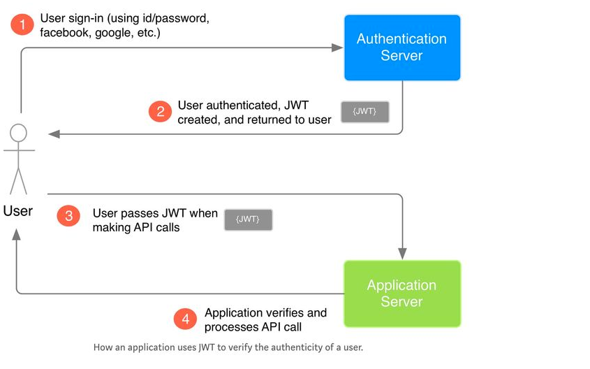

# Login 登录

## JWT

Jwt 全称 Json web token, 是为了在网络应用环境间传递声明而执行的一种基于 `JSON` 的开放标准（RFC 7519）。该 token 被设计为紧凑且安全的，特别适用于分布式站点的单点登录（SSO）场景。

<figure><figcaption>
jwt 流程图
</figcaption></figure>

流程描述一下：

1. 用户使用账号、密码登录应用，登录的请求发送到Authentication Server。
2. Authentication Server进行用户验证，然后创建JWT字符串返回给客户端。
3. 客户端请求接口时，在请求头带上JWT。
4. Application Server验证JWT合法性，如果合法则继续调用应用接口返回结果。

### 实现示例

<pre class="language-python"><code class="lang-python"><strong># pip install pyJWT
</strong># JwtProject/api/views.py

import uuid
import jwt
import datetime
from jwt import exceptions
from django.http import JsonResponse
from django.views import View
from django.conf import settings
from .models import UserInfo

class JwtLoginView(View):

   def post(self, request):
       user_name = request.POST.get("username")
       pwd = request.POST.get("password")

       # 校验用户是否存在
       user = UserInfo.objects.filter(username=user_name, password=pwd).first()

       if not user:
           return JsonResponse({"code": 1001, "error": "用户名或密码不正确"})

       # 头部信息
       header = {
           "typ": "jwt",
           "alg": "HS256"
      }

       # 载荷信息
       payload = {
           "name": user.username,
           "exp": datetime.datetime.utcnow() + datetime.timedelta(minutes=5)
      }

       token = jwt.encode(payload=payload, key=settings.SECRET_KEY, algorithm="HS256", headers=header).decode("utf-8")

       return JsonResponse({"code": 1000, "token": token})

class JwtOrderView(View):

   def get(self, request):
       # 获取token，校验用户身份
       token = request.GET.get("token")

       # 第一步，切割 jwt
       # 第二步，解密第二段，校验是否过期
       # 第三步，校验第三段是否正确

       payload = None
       msg = None

       try:
           payload = jwt.decode(token, settings.SECRET_KEY, True)
           print(payload)
       except exceptions.ExpiredSignatureError:
           msg = "签证已失效"
       except exceptions.DecodeError:
           msg = "token认证失败"
       except exceptions.InvalidTokenError:
           msg = "非法token"

       if not payload:
           return JsonResponse({"code": 1001, "message": msg})

       return JsonResponse({"code": 1000, "message": "订单列表"})
</code></pre>

### JWT 与 Token的关系

## References

JWT 技术介绍 [https://mp.weixin.qq.com/s/YL8kU3csDFXAk3ac5j2VVg](https://mp.weixin.qq.com/s/YL8kU3csDFXAk3ac5j2VVg)&#x20;

不懂就学，什么是JWT？[https://mp.weixin.qq.com/s/Q4rO3ycGtBLGlnPdlcHh2g](https://mp.weixin.qq.com/s/Q4rO3ycGtBLGlnPdlcHh2g)

JWT和Token之间的区别 [https://zhuanlan.zhihu.com/p/668679815](https://zhuanlan.zhihu.com/p/668679815)

\

