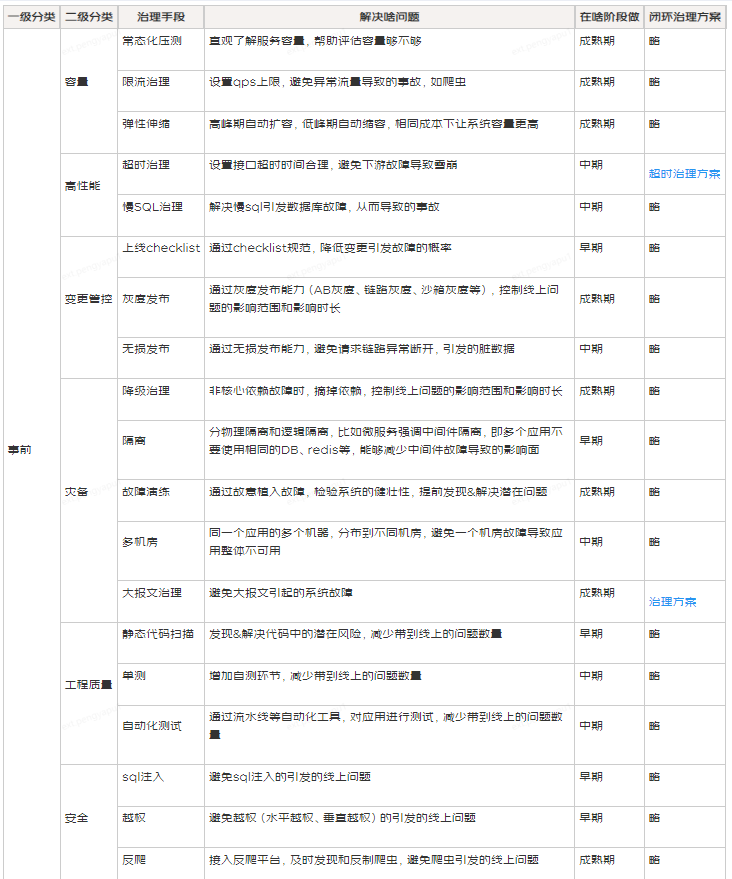

# SRE(Site Reliability Engineering) 网站可靠性建设

<figure><figcaption></figcaption></figure>

<figure><figcaption></figcaption></figure>

<figure><figcaption></figcaption></figure>

## References

[稳定性建设系列文章1\_大纲&方法论](https://segmentfault.com/a/1190000041671012)

[稳定性建设系列文章2\_依赖关系治理](https://segmentfault.com/a/1190000041720534)

[稳定性建设系列文章3\_全链路压测](https://segmentfault.com/a/1190000041751358)

[稳定性建设系列文章4\_故障演练](https://segmentfault.com/a/1190000041886081)

[稳定性建设框架 | 京东物流技术团队](https://my.oschina.net/u/4090830/blog/10106419)

