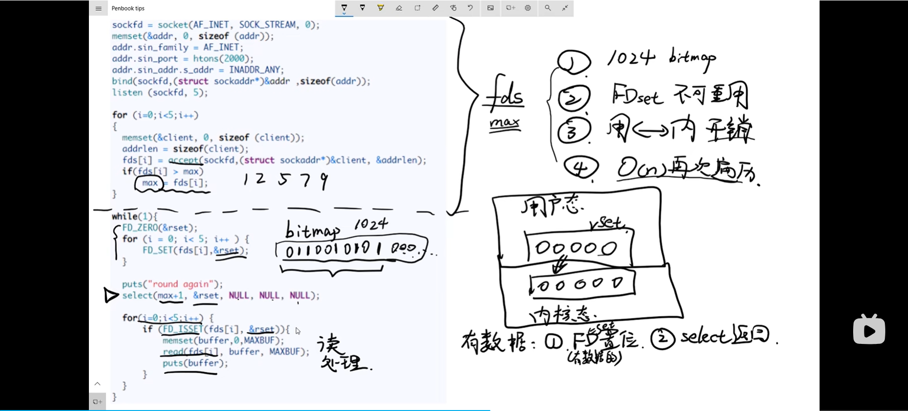

# RedisBottomLevelDataStructure

## Redis数据类型与底层数据结构关系

<figure><figcaption></figcaption></figure>

## SDS 简单动态字符串&#x20;

SDS（Simple Dynamic Strings）是Redis中用于表示字符串的数据结构之一，它具有以下特点：

灵活性： SDS 可以存储字符串，也可以存储二进制数据，包括空字符，因此在处理二进制数据时更为灵活，不受空字符的限制。 缓存长度信息： SDS 在头部保存了字符串的长度信息，因此可以在 O(1) 的时间复杂度内获取字符串的长度，而不需要遍历整个字符串，提高了获取长度的效率。 动态扩容： SDS 可以根据实际存储的数据动态扩容，当字符串长度变长时，SDS 会自动进行内存的扩展，而不需要手动管理内存，提高了内存管理的便利性。 SDS 的设计使得它在处理字符串时更为灵活和高效，因此在 Redis 中被广泛应用于存储和处理字符串数据。

## LinkedList 双端链表&#x20;

Redis中的 List 就是⽤双端链表实现的，双端链表（Doubly Linked List）是一种链表数据结构，每个节点除了包含指向下一个节点的指针外，还包含指向上一个节点的指针，双端链表的链表节点可以保存不同类型的值，⽀持在两端进⾏元素的快速插⼊和删除，并且链表结构提供了表头指针和表尾指针，获取链表的表头节点和表尾节点的时间复杂度只需O(1)； 获取链表数量的时间复杂度也只需O(1)。

双端链表的节点结构通常包含以下两个指针：

指向下一个节点的指针（Next Pointer）：指向链表中的下一个节点。 指向上一个节点的指针（Previous Pointer）：指向链表中的上一个节点。 双端链表的优点：

可以在头部和尾部高效地进行插入和删除操作，时间复杂度为 O(1)。 可以支持双向遍历，能够从头部和尾部同时进行遍历操作。 双端链表的缺陷：

链表每个节点之间的内存都是不连续的，意味着⽆法很好利⽤ CPU 缓存 保存⼀个链表节点的值都需要⼀个链表节点结构头的分配，内存开销较⼤。 双端链表常被用于需要频繁进行插入和删除操作，并且需要支持双向遍历的场景，比如实现队列、栈、LRU缓存等数据结构和算法。

## ZipList 压缩列表&#x20;

压缩列表（ZipList）是一种用于在 Redis 中紧凑存储列表和哈希表数据的数据结构。它是由一系列特定编码格式的连续内存块组成的顺序型数据结构，每个内存块称为一个节点（entry）。每个节点可以存储一个字节数组或整数值，并且可以根据实际存储的数据动态地调整节点的长度。

压缩列表的主要特点包括：

紧凑存储：压缩列表采用紧凑的内存布局，节点之间紧密相连，节省了内存空间。 可变长度：每个节点的长度可以根据实际存储的数据动态地调整，避免了不必要的内存浪费。 支持多种数据类型：压缩列表可以存储不同类型的数据，包括字符串和整数值。 快速随机访问：压缩列表支持通过索引快速定位到指定位置的节点，因此可以在 O(1) 的时间复杂度内实现随机访问。 适应于小规模数据：压缩列表适用于存储小规模的数据集，当数据量较大时，会转换为其他更适合大规模数据的数据结构，比如双端链表或跳表。 压缩列表在 Redis 中被广泛应用于列表和哈希表数据类型的实现中，能够高效地存储和操作数据，提升了 Redis 的性能和内存利用率。

## HashTable 哈希表&#x20;

哈希表（Hash Table）是一种用于存储键值对（key-value pairs）的数据结构，在 Redis 中被广泛应用于实现各种数据类型，如哈希表（Hashes）和集合（Sets）等。

在哈希表中，每个键都经过哈希函数处理后映射到一个唯一的索引位置，然后将对应的值存储在该位置上。这样，通过键可以快速定位到对应的值，实现了高效的查找操作。

哈希表的主要特点包括：

快速查找：通过键进行哈希计算，可以快速定位到对应的值，具有 O(1) 的平均时间复杂度。 灵活性：哈希表可以存储各种类型的键值对，不限于字符串和整数。 动态扩容：在数据量增加时，哈希表可以动态地扩容以适应新的键值对的存储需求。 碰撞处理：由于哈希函数可能会将不同的键映射到同一个索引位置上，因此需要使用碰撞处理技术来解决冲突，常见的方法包括链地址法和开放定址法等。 在 Redis 中，哈希表被用于实现哈希表数据类型（Hashes），它可以存储多个键值对，并且支持对单个键值对的增、删、改、查等操作。此外，哈希表还被用于实现集合数据类型（Sets）中的有序集合（Sorted Sets），用于存储成员和对应的分值之间的关系。

## IntSet 整数集合&#x20;

整数集合（Integers Set）是 Redis 中的一种特殊数据结构，用于高效地存储整数值的集合。它是为了在存储一组整数时，提供更加紧凑和高效的存储方式而设计的。

整数集合的主要特点包括：

紧凑存储：整数集合使用紧凑的数据结构存储整数值，不像普通的数组那样每个元素都需要占用固定的内存空间，而是根据整数的大小动态调整所需的存储空间，节省了内存的使用。 快速查找：由于整数集合中的元素是有序的，并且使用了特定的算法进行存储和查找，因此可以在 O(logN) 的时间复杂度内实现查找操作，其中 N 表示整数集合中的元素个数。 支持多种整数类型：整数集合可以存储多种整数类型，包括 int16、int32、int64 等，根据存储的整数值的大小自动选择合适的数据类型。 动态调整：整数集合在存储整数值的过程中，会根据需要动态调整存储空间，避免了固定大小数组可能带来的空间浪费或溢出问题。 整数集合在 Redis 中被广泛应用于存储集合数据类型（Sets）中的整数成员，例如用于存储用户 ID、商品 ID 等。由于其高效的存储方式和快速的查找性能，使得整数集合成为了处理整数集合类数据的首选数据结构之一。

## SkipList 跳表&#x20;

跳跃表是⼀种在链表基础上改进过来的，实现了⼀种「多层」的有序链表，当数据量很⼤时，跳表的查找复杂度就 是O(logN)。在 Redis 中，有序集合（Sorted Set）就是通过跳表来实现的，因为跳表具有快速的查找和插入操作，非常适合用于实现有序集合类数据结构。

跳表的查找过程？

1.查找⼀个跳表节点的过程时，跳表会从头节点的最⾼层开始，逐⼀遍历每⼀层。在遍历某⼀层的跳表节点时，会⽤ 跳表节点中的 SDS 类型的元素和元素的权重来进⾏判断：

2.如果当前节点的权重⼩于要查找的权重时，跳表就会访问该层上的下⼀个节点。

3.如果当前节点的权重等于要查找的权重时，并且当前节点的 SDS 类型数据⼩于要查找的数据时，跳表就会访 问该层上的下⼀个节点。

4.如果上⾯两个条件都不满⾜，或者下⼀个节点为空时，跳表就会使⽤⽬前遍历到的节点的 level 数组⾥的下⼀层指 针，然后沿着下⼀层指针继续查找。

跳表的主要特点包括：

多级索引：跳表通过维护多级索引，使得在查找时可以跳过部分元素，从而减少查找的时间复杂度。每一级索引都是一个- 有序链表，最底层的链表包含所有元素，而上层的链表包含更少的元素，相邻两级索引的元素数量相差较大。 插入和删除高效：由于跳表中的每一级索引都是有序的链表，因此在插入和删除元素时，只需要调整相邻节点的指针即可，不需要像平衡树那样进行复杂的平衡操作，因此插入和删除操作的时间复杂度为 O(logN)，其中 N 表示跳表中的元素数量。 支持快速查找：由于跳表维护了多级索引，因此在查找时可以根据索引快速定位到目标元素所在的范围，然后再在范围内使用顺序查找进行查找，这样可以将查找的时间复杂度降低到 O(logN)。 跳表相对于平衡树来说实现更加简单，并且在实际应用中具有较好的性能表现。

## quicklist&#x20;

Quicklist（快速列表）是 Redis 中用于存储列表类型数据的一种高效数据结构。它是双向链表 + 压缩列表的混合体，quicklist 就是⼀个链表，⽽链表中的每个元素⼜是⼀个压缩列表。 quicklist 解决办法，通过控制每个链表节点中的压缩列表的⼤⼩或者元素个数，来规避连锁更新的问题。因为压缩列表元素越少或越⼩，连锁更新带来的影响就越⼩，从⽽提供了更好的访问性能。可以在列表的两端进行快速插入和删除操作，并且在内部使用压缩列表来节省内存空间。

快速列表的主要特点包括：

双向链表特性：快速列表包含多个节点，每个节点都是一个双向链表。这使得在列表的两端进行插入和删除操作时具有较高的效率，时间复杂度为 O(1)。 压缩列表优势：每个节点内部使用压缩列表来存储列表元素。压缩列表是一种紧凑的、可变长度的连续内存块，可以高效地存储多个元素，并且在元素数量较小时节省内存空间。 节点间指针：快速列表中的节点之间通过指针进行连接，使得可以在节点之间进行快速的遍历和操作。 灵活性：快速列表可以根据实际存储的数据动态调整节点的数量和大小，从而实现空间利用的最大化和性能的最优化。 由于快速列表同时具备双向链表和压缩列表的优势，因此在 Redis 中被广泛应用于存储列表类型数据，如列表、队列等，以满足不同场景下的需求。

## Listpack&#x20;

Listpack 是 Redis 中用于存储列表类型数据的一种紧凑、高效的数据结构。它是一种类似于压缩列表的数据结构，但相比于压缩列表，Listpack 在一些方面进行了优化和改进。listpack 没有压缩列表中记录前⼀个节点⻓度的字段，listpack 只记录当前节点的⻓度，当我们向 listpack 加⼊⼀个新元素的时候，不会影响其他节点的⻓度字段的变化，从⽽避免了压缩列表的连锁更新问题。

Listpack 的主要特点包括：

紧凑性：Listpack 在内存中存储数据时非常紧凑，它只记录当前节点的长度，而不记录前一个节点的长度。这种设计避免了像压缩列表那样可能引发的连锁更新问题，提高了内存使用的效率。 高效性：Listpack 在插入和删除操作时具有较高的性能，因为它不需要更新前一个节点的长度字段。这使得对于列表中的某个节点进行操作时，不会影响到其他节点的数据结构，减少了操作的开销和复杂度。 灵活性：Listpack 可以根据实际存储的数据动态调整节点的大小和数量，从而在不同场景下实现空间的最大化利用和性能的最优化。 总的来说，Listpack 是 Redis 中用于存储列表类型数据的一种高效、灵活的数据结构，它在内存使用效率和操作性能上具有较好的表现，适用于存储大量的列表数据，并且在 Redis 内部的实现中得到了广泛应用。

## References

[Redis5种基本数据结构底层实现](https://www.cnblogs.com/CryFace/p/13762241.html)

[一文彻底搞懂Redis底层数据结构](https://blog.csdn.net/weixin\_44772566/article/details/137008421)

\

\

\
